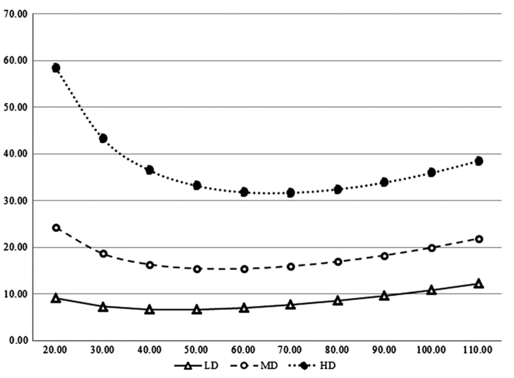

# Véhicules Thermiques  

## Introduction 

Véhicules thermiques  
Notre méthodologie pour estimer les émissions des véhicules thermiques utilisés dans la logistique de dernière mile vise à être en accord avec les normes et principes internationaux, en incorporant des caractéristiques proposées et recommandées par des entités de référence et des autorités en la matière, telles que l'IMO, le GLEC et l'ADEME.

Cependant, nos estimations intègrent des aspects qui nous permettent d'aller au-delà et d'obtenir des estimations précises. C'est précisément ce que recommande le GLEC, car il fournit un cadre de référence pour que tous les acteurs logistiques aient un guide et une base pour estimer leurs émissions. Ces procédures sont générales et, dans certains cas, utilisent des valeurs moyennes pour être faciles et pratiques à appliquer. Néanmoins, le GLEC suggère que chaque acteur logistique développe de nouvelles méthodologies adaptées à sa réalité, en tenant compte des informations, des ressources, des besoins et des caractéristiques propres.

C'est pourquoi, sans négliger les recommandations et principes les plus importants, chez Deki, nous avons fait des efforts pour obtenir des estimations plus précises. Estimer les émissions des véhicules thermiques est l'un de nos principaux intérêts. Un véhicule thermique, également connu sous le nom de véhicule à combustion interne, utilise un moteur à combustion interne pour générer de l'énergie et propulser le véhicule. Dans ces moteurs, l'énergie chimique stockée dans les carburants est convertie en énergie mécanique, qui est ensuite utilisée pour déplacer le véhicule. Parmi les principaux carburants utilisés par ces types de véhicules, on trouve l'essence, le diesel, le gazole, le GPL, le GNC, l'éthanol ou le biodiesel.

La base de cette méthodologie consiste à estimer d'abord la consommation de carburant du véhicule effectuant une livraison, en tenant compte de différentes variables et aspects fondamentaux qui déterminent la consommation du moteur. Parmi ces aspects figurent la vitesse du véhicule, le poids des marchandises et le poids du véhicule lui-même, entre autres. Tous ces aspects bénéficient d'une validation scientifique et statistique.

La reconnaissance et l'identification des aspects fondamentaux qui déterminent la consommation de carburant ont été des éléments clés du travail réalisé chez Deki et sont basées sur les informations disponibles dans la littérature scientifique et dans les rapports d'institutions et d'organismes nationaux et internationaux que nous avons déjà mentionnés, tels que (IMO, EDEM, GLEC).

Il existe une large gamme de facteurs qui influent sur la consommation de carburant dans les opérations logistiques utilisant des véhicules thermiques. Ainsi, une façon d'aborder leur analyse est de les regrouper. Nous pouvons donc les diviser en 5 groupes :

1. Facteurs liés au véhicule : Ils incluent le poids du véhicule, le poids du moteur, l'ancienneté, l'entretien, entre autres. Un véhicule plus lourd ou plus ancien a tendance à consommer plus de carburant et à émettre plus de gaz à effet de serre, notamment du CO2.

2. Facteurs liés à l'environnement : Vitesse du vent, type de route, inclinaison, etc. Ces facteurs influencent les forces auxquelles le véhicule est confronté, affectant ainsi sa consommation de carburant.

3. Facteurs liés à la circulation : Vitesse, accélération, congestion routière, entre autres. Ils sont fondamentaux dans l'estimation de la consommation et des émissions lors des livraisons.

4. Facteurs liés à l'opération : Distance à parcourir, nombre d'arrêts, composition de la flotte, poids des marchandises, etc.

5. Facteurs liés au conducteur : L'agressivité au volant, les choix de changement de vitesse et d'autres aspects qui définissent le style de conduite du conducteur. Bien qu'ils soient difficiles à mesurer, il est important de les prendre en compte.

Ces facteurs sont cruciaux pour comprendre l'impact environnemental de la logistique des livraisons en dernière mile, et il est donc essentiel de les analyser un par un pour déterminer lesquels sont les plus importants et comment et dans quelle mesure ils influencent la consommation de carburant. Un exemple de cette analyse peut être effectué avec le graphique suivant estimé par (citation), qui montre la relation entre la consommation de carburant dans différents types de véhicules (légers (LD), moyens (MD) et lourds (HD)) :

Sur ce graphique, on constate que, pour tous les types de véhicules, à faible vitesse, la consommation de carburant est élevée et diminue à mesure que la vitesse augmente jusqu'à un certain point où elle augmente à nouveau.

Ce comportement dans la consommation de carburant s'explique par le fait qu'à faible vitesse, à la fois le travail de la roue et l'efficacité augmentent avec la vitesse ; cependant, l'efficacité augmente de manière significativement plus importante que le travail de la roue, ce qui se traduit par une réduction de la consommation de carburant. À des vitesses modérées, le travail de la roue et l'efficacité augmentent approximativement de manière proportionnelle à la vitesse. À des vitesses élevées, le travail de la roue augmente de manière drastique, tandis que l'efficacité reste constante, puis diminue, ce qui entraîne une augmentation de la consommation de carburant avec la vitesse.

Dans ces estimations, le facteur de charge des véhicules était nul et il n'y avait pas de dénivelé sur le trajet. Cependant, un autre aspect à prendre en compte est le poids des véhicules, et ce graphique permet de mettre en évidence ce facteur, car les véhicules les plus lourds consomment plus de carburant.

À partir de la consommation de carburant, il est facile de déterminer la quantité d'émissions du véhicule. Selon les principes du "Greenhouse Gas Protocol", pour estimer les émissions du carburant, il est important de considérer le cycle de vie complet de celui-ci. Cela inclut non seulement les émissions générées pendant son utilisation, mais aussi celles produites pendant sa production, sa distribution et son transport jusqu'au point de consommation. Ces émissions sont appelées facteurs d'émission "du puits à la roue" (Well-to-wheel) ou WTW.

Ces facteurs d'émission WTW sont divisés en deux catégories : 

1. Du puits au réservoir (WWT) : Ces émissions comprennent toutes celles libérées depuis la source d'énergie ou le puits jusqu'au point d'utilisation du combustible. Cela inclut les émissions générées pendant l'extraction, le transport, la purification et le traitement du combustible, entre autres. Ces facteurs varient en fonction de la source d'énergie, de la région et des méthodes d'extraction, de traitement et de transport.  

2. Du réservoir à la roue (TTW) : Les émissions TTW sont celles qui sont directement générées pendant la combustion.  
Prendre en compte ces deux facteurs est essentiel pour obtenir une estimation précise et complète des émissions de gaz à effet de serre associées à l'utilisation des carburants, ce qui permet de prendre des décisions plus éclairées pour faire face aux impacts environnementaux du transport. Il est important de tenir compte de ces facteurs pour que les estimations des émissions soient valables pour différentes régions et pays. :

